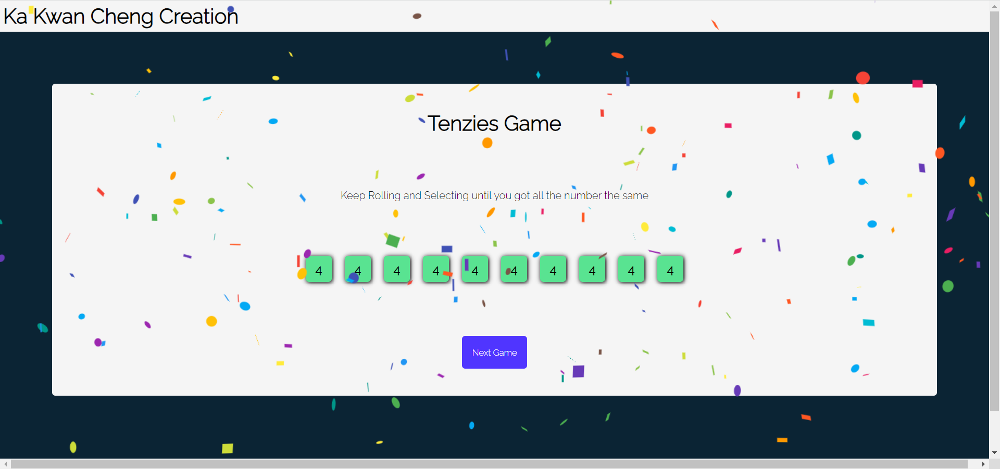
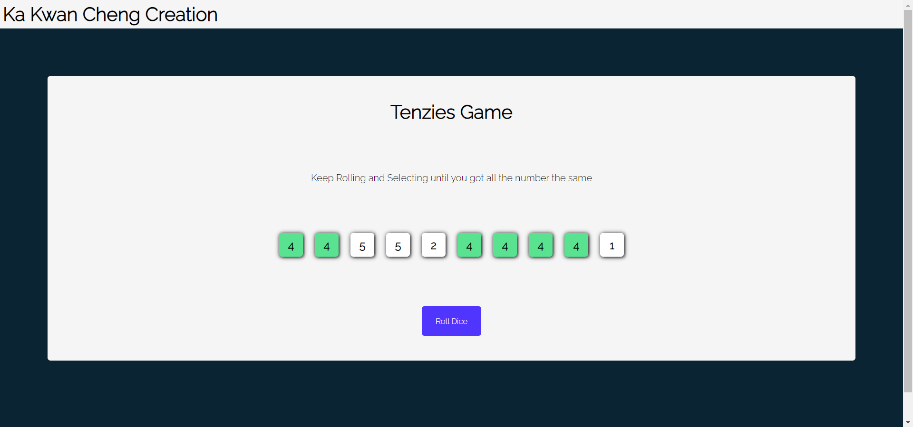

## tenzieGames

Luck testing app: tenzie Game
 
random number from 1 to 6 are given randomly in ten boxes.
 
Click on the box to hold the number you want
 
Click on the Roll button to regenerate unwanted number.
 
The goal is to win the game with ten same number.
 
What you get is your luck index :)
 
Link: [tenzieGame](https://prod.d3422cj9r5dusu.amplifyapp.com/)

### Design Process

It is a simple and fun project to build, not much design required.
 
model the game with an array of numbers, and make the number looks like a button and clickable.
 
start manage the few state, one state is the array itself, the other state is if you win the game or not.

### Features to add in the future

1. show how many roll dice you needed to win(really checking your luck)
2. implement restart game button while still playing the current game
3. modify UI

### Library Involved

- [Confetti](https://www.npmjs.com/package/react-confetti)

### Critical User Jouney

start game page
 

 
clicked button page
 

 
finished game page
 

